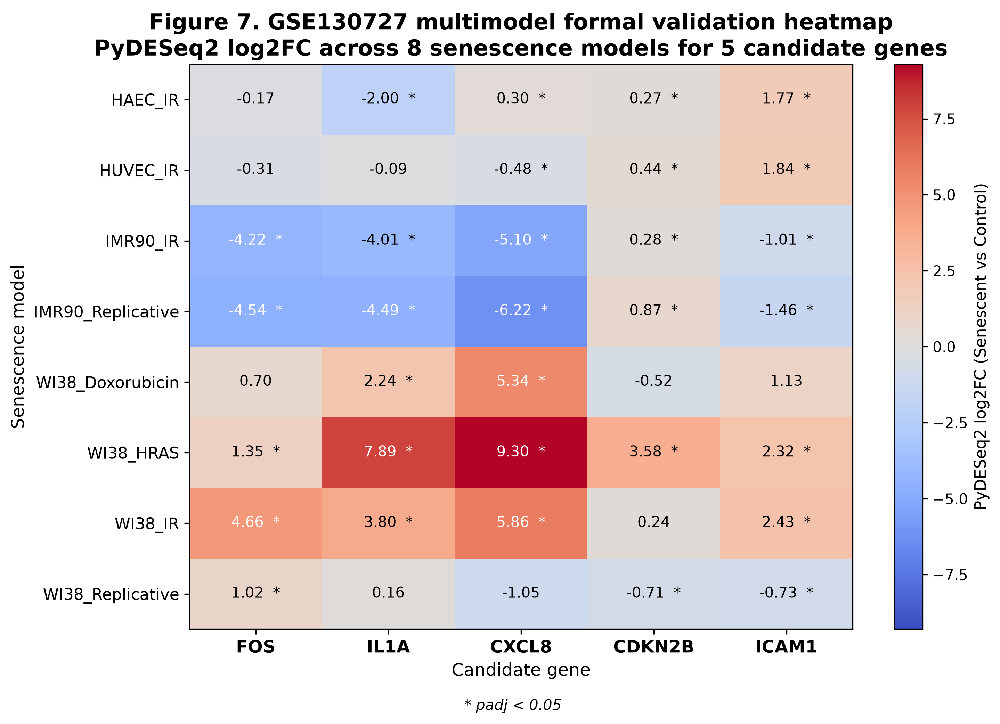
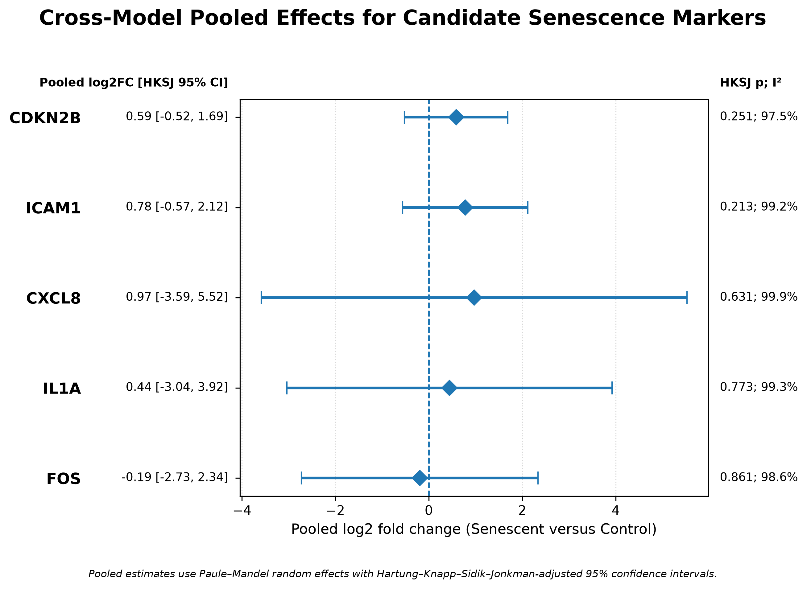
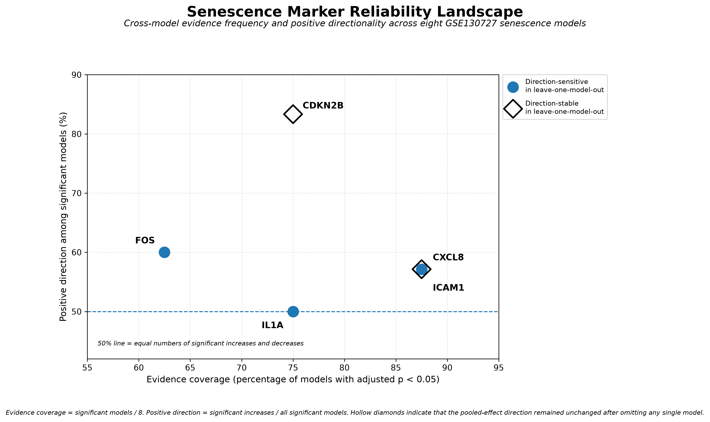

# Cross-Model Transcriptomic Benchmarking of Candidate Cellular Senescence Markers

Computational analysis of candidate cellular senescence markers across independent transcriptomic datasets, cell types, and senescence induction methods.

The project evaluates whether commonly used senescence-associated transcripts behave consistently across biological contexts or whether their direction and statistical support depend strongly on the experimental model.

Five pathway-prioritized candidate genes were evaluated:

**FOS, IL1A, CXCL8, CDKN2B, and ICAM1**

---

## Project Overview

Cellular senescence is commonly assessed using markers associated with cell-cycle arrest, inflammatory signaling, and the senescence-associated secretory phenotype (SASP). However, individual markers may behave differently depending on cell type, senescence trigger, and experimental design.

This project uses a multi-stage computational workflow to evaluate candidate-marker reproducibility across independent transcriptomic datasets.

The analysis includes:

1. Discovery of senescence-associated genes in BJ fibroblasts.
2. Pathway enrichment and candidate prioritization.
3. Independent validation in WI-38 replicative senescence.
4. Cross-model differential-expression analysis across eight senescence comparisons.
5. Random-effects meta-analysis.
6. Hartung-Knapp-Sidik-Jonkman uncertainty estimation.
7. Leave-one-model-out and shared-control sensitivity analyses.
8. Candidate reliability benchmarking.

---

## Research Question

**Do individual senescence-associated transcripts show reproducible directional behavior across different cellular and experimental models of senescence?**

The analysis specifically tests whether relatively stable growth-arrest-associated markers such as **CDKN2B** show greater directional robustness than inflammatory, secretory, adhesion-associated, and stress-response transcripts.

---

## Datasets

| Dataset / Stage | Biological Context | Repository Input | Purpose |
|---|---|---|---|
| BJ fibroblast discovery | Young vs. senescent BJ fibroblasts | GEO2R differential-expression table | Candidate discovery |
| GSE175533 | WI-38 replicative senescence | Processed endpoint and time-course candidate results | Independent validation |
| GSE130727 | Endothelial and fibroblast senescence models | Gene count matrix and matched comparison design | Cross-model benchmarking |

GSE130727 contains eight matched senescence comparisons spanning multiple cell types and induction methods, including ionizing radiation, replicative senescence, doxorubicin, and HRAS-induced senescence.

---

## Analysis Workflow

```text
BJ fibroblast discovery
        ↓
Differential-expression filtering
        ↓
GO / Reactome pathway prioritization
        ↓
Five candidate genes
        ↓
GSE175533 independent validation
        ↓
GSE130727 eight-model PyDESeq2 analysis
        ↓
Random-effects meta-analysis
        ↓
HKSJ confidence intervals
        ↓
Leave-one-model-out sensitivity analysis
        ↓
Candidate reliability benchmarking
```

---

## Key Results

### BJ Fibroblast Discovery

The discovery dataset contained **17,636 genes**.

Using an adjusted p-value < 0.05 and |log2 fold change| > 1, the analysis identified **1,609 significant genes**:

- **707 higher in Young**
- **902 higher in Senescent**

Pathway enrichment highlighted cellular senescence, SASP, cytokine signaling, oxidative-stress-induced senescence, DNA damage/telomere stress, and extracellular-matrix organization.

The five prioritized non-histone candidates were:

**FOS, IL1A, CXCL8, CDKN2B, and ICAM1**

---

### Independent WI-38 Validation — GSE175533

| Gene | Validation |
|---|---|
| CDKN2B | Strong validation |
| IL1A | Strong validation |
| CXCL8 | Partial validation |
| ICAM1 | Partial validation |
| FOS | Not validated as an increasing marker |

---

### Cross-Model Benchmarking — GSE130727

Five genes were evaluated across eight matched senescence comparisons, producing **40 candidate-model tests**:

- **19 significant increases**
- **12 significant decreases**
- **9 not significant**

The results demonstrated substantial context dependence across cell types and senescence-induction methods.

---

### Candidate Reliability

| Gene | Significant Increases | Significant Decreases | Not Significant | Positive Direction Among Significant Models | LOO Direction Stability |
|---|---:|---:|---:|---:|---|
| CDKN2B | 5 | 1 | 2 | 83.33% | Stable |
| IL1A | 3 | 3 | 2 | 50.00% | Sensitive |
| CXCL8 | 4 | 3 | 1 | 57.14% | Sensitive |
| ICAM1 | 4 | 3 | 1 | 57.14% | Stable |
| FOS | 3 | 2 | 3 | 60.00% | Sensitive |

**CDKN2B showed the greatest positive directional robustness among the five evaluated candidates.**

ICAM1 retained a positive pooled direction throughout leave-one-model-out analysis, although its model-specific effects remained highly heterogeneous.

---

## Meta-Analysis

Model-specific log2 fold changes and standard errors were synthesized using **Paule-Mandel random-effects models** with **Hartung-Knapp-Sidik-Jonkman (HKSJ) confidence intervals**.

No full eight-model HKSJ confidence interval excluded zero.

All five candidates showed extreme between-model heterogeneity:

**I² > 97%**

These results indicate that none of the evaluated transcripts behaves as a universal increasing senescence marker across all tested contexts.

---

## Main Interpretation

The results support a **context-aware approach to senescence assessment** rather than reliance on a single universal transcript.

CDKN2B showed the strongest positive directional consistency across the evaluated models, while inflammatory, secretory, adhesion-associated, and stress-response genes showed greater context dependence.

A multi-marker panel combining relatively stable cell-cycle-arrest evidence with context-specific inflammatory or secretory markers may provide a more reliable strategy for evaluating cellular senescence.

---

## Selected Figures

### Cross-Model Differential Expression



### Random-Effects Meta-Analysis



### Candidate Reliability Landscape



---

## Repository Structure

```text
cellular-senescence-cross-model-benchmarking/
│
├── Code/
│   └── Python analysis and visualization scripts
│
├── Data/
│   ├── BJ_Discovery/
│   ├── GSE175533_WI38/
│   └── GSE130727_Multimodel/
│
├── Results/
│   ├── BJ_Discovery/
│   ├── GSE175533_WI38/
│   ├── GSE130727_Multimodel/
│   ├── MetaAnalysis/
│   └── Integrated/
│
├── Figures/
│   ├── Validation/
│   ├── Multimodel/
│   └── MetaAnalysis/
│
├── requirements.txt
├── .gitignore
└── README.md
```

---

## Installation

The analysis was tested in a Python virtual environment.

From the repository root:

```bash
python3 -m venv .venv
source .venv/bin/activate
python -m pip install -r requirements.txt
```

Principal dependencies include:

```text
matplotlib
numpy
pandas
pydeseq2
scipy
statsmodels
```

---

## Reproducing the Analysis

Run all scripts from the **repository root**.

### 1. BJ Discovery

```bash
python Code/analyze_senescence.py
python Code/analyze_pathways.py
```

### 2. GSE175533 Validation

```bash
python Code/create_GSE175533_validation_summary.py
python Code/plot_GSE175533_validation_summary.py
```

### 3. GSE130727 Candidate Extraction and Differential Expression

```bash
python Code/extract_normalize_GSE130727_candidates.py
python Code/run_GSE130727_pydeseq2.py
python Code/plot_GSE130727_pydeseq2_heatmap.py
```

### 4. Random-Effects and Sensitivity Analyses

```bash
python Code/run_candidate_meta_analysis.py
python Code/run_candidate_hksj_meta_analysis.py
python Code/run_candidate_sensitivity_analysis.py
```

### 5. Reliability Analysis and Figures

```bash
python Code/create_candidate_reliability_metrics.py
python Code/plot_candidate_forest_plots.py
python Code/plot_pooled_hksj_summary.py
python Code/plot_candidate_reliability_landscape.py
```

### 6. Integrated Candidate Summary

```bash
python Code/create_bmes_integrated_candidate_summary.py
```

---

## Reproducibility Scope

This repository intentionally distinguishes between raw-data processing and the portions of the analysis reproduced here.

For **GSE130727**, the included gene count matrix and comparison design allow the eight PyDESeq2 analyses, candidate extraction, meta-analysis, sensitivity analysis, reliability metrics, and downstream figures to be regenerated.

For **GSE175533**, the repository begins from processed endpoint candidate statistics and study-derived time-course differential-expression results. It reproduces the integrated validation classification and downstream figure, but does not recreate the original study's complete RNA-seq processing pipeline.

For the **BJ discovery analysis**, the repository begins from a GEO2R differential-expression table. The g:Profiler enrichment export used for pathway prioritization is also included. The repository therefore reproduces filtering, candidate prioritization, and downstream analyses rather than raw-read alignment or the g:Profiler web query itself.

---

## Statistical Notes

Differential expression in GSE130727 was performed separately for each matched model using **PyDESeq2**.

Several comparisons contain small sample sizes. PyDESeq2 therefore reports dispersion-estimation warnings for some models with limited residual degrees of freedom. These warnings do not prevent model fitting but are an important limitation when interpreting individual comparisons.

The very high cross-model heterogeneity further supports interpretation of the candidates as **context-dependent markers rather than universal single-gene indicators of senescence**.

---

## Author

**Alejandro León Arguelles**  
Biomedical Engineering  
University of South Florida

GitHub: **@liontank06-source**

---

## Project Status

This repository documents an undergraduate computational research project in cellular senescence and transcriptomic benchmarking.

The repository is intended for research documentation, reproducibility, and academic portfolio purposes. It should not be interpreted as a peer-reviewed publication.